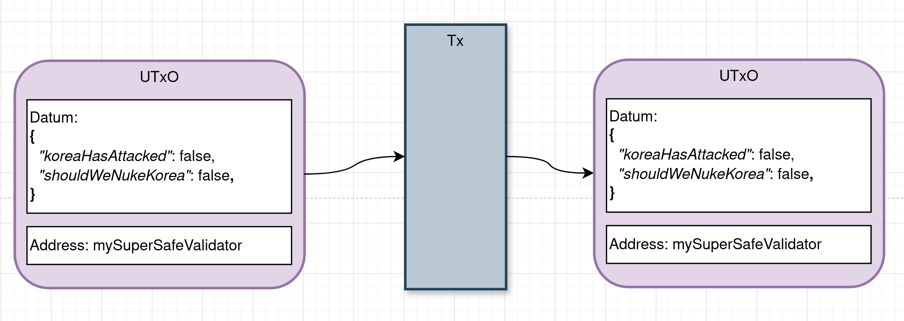
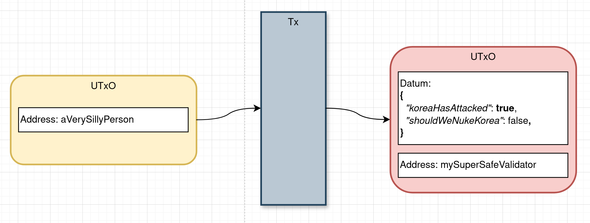
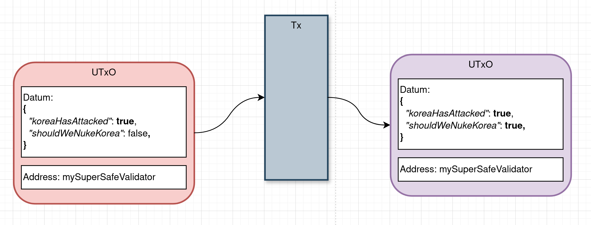
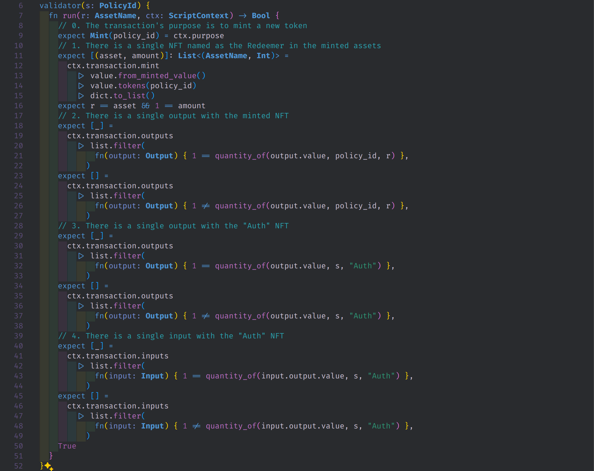
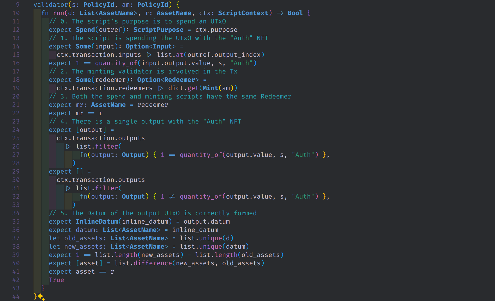
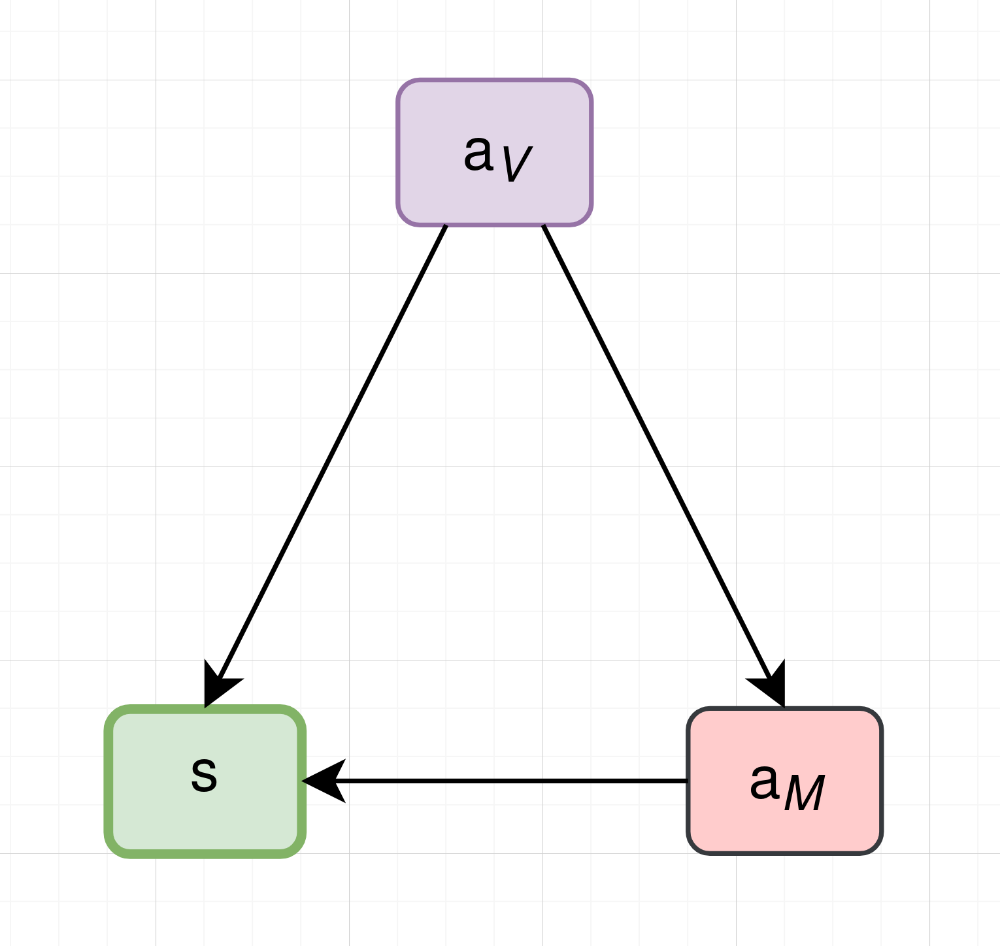
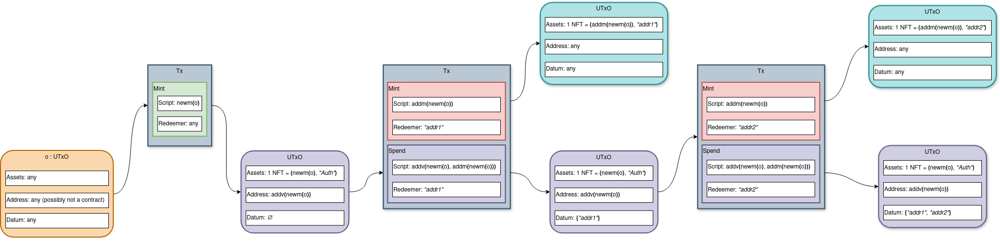
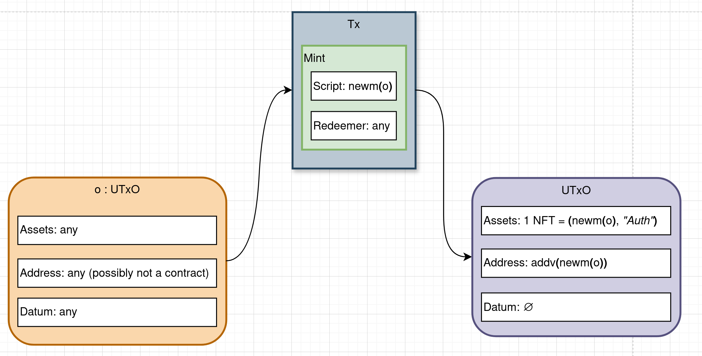
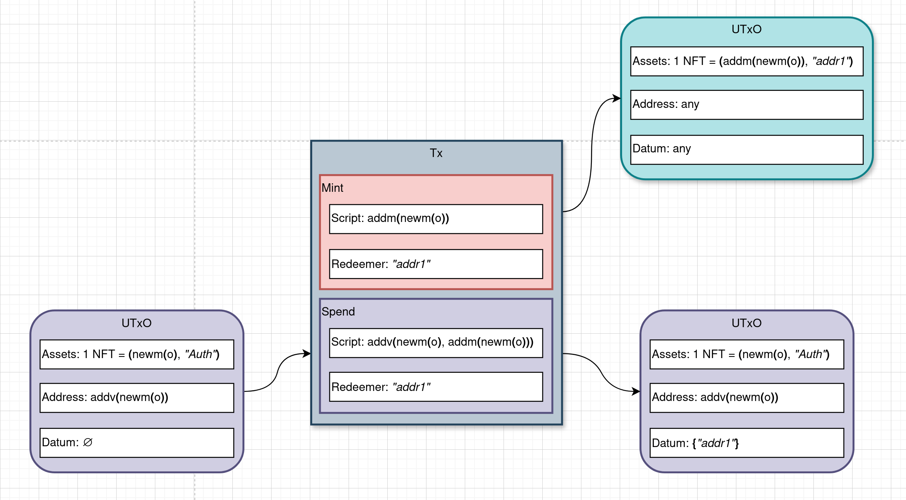
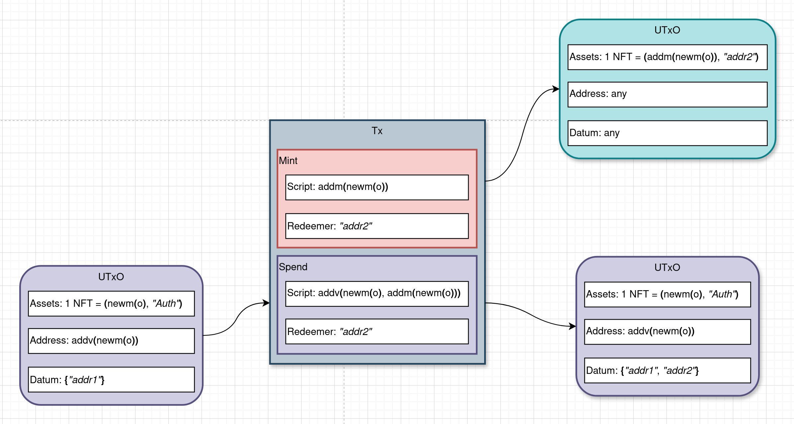

# Stateful Smart Contracts On Cardano

## Part 1. Securing The Distributed State With NFTs

Lorenzo Fanton

887857@stud.unive.it

---

## Problem

At the lowest level, we need to:

1. Distribute a smart contract's state over _mutiple_ UTxOs, _and_...

2. ... Ensure that it cannot be compromised by an attacker.

Otherwise, it would be pointless to use whatever abstractions we might come up with.

---

## Problem

An informal statement of the problem might be the following.

> A smart contract's state, distributed over multiple of UTxOs, should be modified only by transactions validated by the smart contract itself.

---

## Problem

There are good news and bad news.

* **Good news**: Smart contracts (on-chain) can enforce the recipient(s) of the UTxOs being created, but...

* **Bad news**: ... They have **zero knowledge** about the sender of the UTxOs being spent.

**Why is that a problem?**

---

## Example: Good State

In a normal setup, a stateful smart contract would ensure that the state is propagated to itself.

---

## Example: Attacker Setup

However, an attacker might craft a malicious piece of state and "pay" it to the smart contract. Nothing would prevent them to do so.

---

## Example: (Very) Bad State

Now the smart contract would mindlessly use that piece of state to validate whatever transaction. **The contract's state is now compromised.**

---

## Problem

Compromised state could be the source of other, more serious issues. 

What could be worse than WW3? Well, for example:

> _You_ could be losing money!!

While total thermonuclear annihilation might be somewhat tolerable and even fun, losing money is not and we must avoid that at all costs.

---

## Solution

How can we authenticate the UTxOs that get consumed/produced by the transactions validated by our smart contract?

For example, by using a set of unique "tokens" attached to each UTxO, such that:

* They are easily recognizable by the smart contract
* They can be extended without modifying the contract's source code

... Enter NFTs.

---

## Native Tokens And NFTs

Native tokens, also called _assets_ on Cardano, are objects that represent value. Even ADA _can be thought of_ as a special kind of native token. Native tokens are identified by their "asset id", of type $\text{PolicyId} \times \text{AssetName}$:

* $\text{PolicyId} = (\mathbb{F}_{256})^{28}$ hash of the minting script;

* $\text{AssetName} = (\mathbb{F}_{256})^{32}$ arbitrary 32-byte string.

Where $\mathbb{F}_q := \lbrace 0,\dots,q-1 \rbrace$.

---

## Fungible/Not Fungible

Two tokens are said to be _fungible_ if they have the same asset id. 

Example: 

* If I have 2 of `("0x1", "lorenzo")`, then I have 2 tokens that **are** fungible.

* If I have 1 of `("0x1", "hammad")` and 1 of `("0x1", "lorenzo")`, the two tokens **are not** fungible.

* If I have 1 of `("0x10", "hammad")` and 1 of `("0xFF", "hammad")`, the two tokens **are not** fungible.

---

## Minting vs Spending

Minting is the process of creating new tokens. A minting validator is just a smart contract with the following signature $M$:

$$
M = (\text{Redeemer} \times \text{ScriptContext}) \rightarrow \mathbb{B}
$$

Minting validators do not take a $\text{Datum}$ as argument, because they do not spend UTxOs.

An instance of $M$ identifies the $\text{PolicyId}$ of the tokens that can be minted by it.

--- 

## Minting vs Spending

By contrast, spending validators are smart contracts with the following signature $V$:

$$
V = (\text{Datum} \times \text{Redeemer} \times \text{ScriptContext}) \rightarrow \mathbb{B}
$$

---

## Outlining Properties

We said earlier that we want to utilize unique tokens, to guarantee that each piece of the smart contract's state is indeed valid. We want to find a minting technique $T$ such that:

1. $\forall t_1,t_2$ tokens from $T$ . $t_1 \neq t_2$ using the asset id to test for equality.

2. $\forall t_1,t_2$ tokens from $T$ . $t_1 \sim t_2$ where the relation $\sim$ means "$t_1$ and $t_2$ have the same policy id".

---

## Achieving Properties

In particular, if we manage to mint NFTs we get (1) basically for free. However, the (2) is tougher. Usual NFT minting techniques on Cardano fall into two broad categories:

1. Use a script with a predefined timer for its validity (problem: you cannot truly enforce an amount to mint, as long as you mint multiple times before expiration)

2. Use a script parametrized with a UTxO reference. By making sure the UTxO is spent during the minting transaction, the script effectively becomes a one-time minting policy (problem: different UTxOs will produce different policy ids).

---

## Achieving Properties

In the next slides, we will explore a minting technique capable of minting tokens with:

* The **same policy id** (thus, from the same script), but... 
* ... Each with a _different asset name_ (and, as such, **different asset ids**)
* **Without knowing in advance** the number of tokens we want to generate!!

---

## The Minting Technique

Let $\text{OutputReference}$ represent an on-chain reference to an UTxO.

We declare the following functions:

* $f_{start,mint} : \text{OutputReference} \rightarrow M$

* $f_{add,mint} : M \rightarrow M$

* $f_{add,validate} : (M \times M) \rightarrow V$

**NB**: With abuse of notation, we use the actual script instead of its hash when using it as argument. Obviously, in real code the hash (e.g. policy id) is used.

---

## Start $f_{start,mint} : \text{OutputReference} \rightarrow M$

$f_{start,mint}$, when applied to an UTxO reference, returns a one-time minting policy that:

* Gets called only once

* Produces a single NFT "Auth" that is propagated throughout the rest of the process

---

## Start $f_{start,mint} : \text{OutputReference} \rightarrow M$

---

## Add $f_{add, mint} : M \rightarrow M$

$f_{add, mint}$ is applied to the hash of the start script and returns a normal minting policy:

* In principle, it could be called an indefinite number of times to mint arbitrary tokens. 

* However, it checks that the "Auth" NFT is present in the inputs of the transaction.

---

## Add $f_{add, mint} : M \rightarrow M$

---

## Add $f_{add, validate} : (M \times M) \rightarrow V$

$f_{add, validate}$ is applied to the start script and the add minting script. It returns a spending validator that:

* Propagates the "Auth" NFT

* Checks that its minting "counterpart" is called in the same transaction

* Propagates (via the $\text{Datum}$) the set of already minted assets, failing the transaction if someone is trying to mint something pre-existent (with the same asset name).

---

## $f_{add, validate} : (M \times M) \rightarrow V$

---

## The Minting Technique

In particular, let $o : \text{OutputReference}$.

We build the following three contracts that will take part in the generation of our NFTs:

* $(s : M) = f_{start,mint}(o)$

* $(a_M : M) = f_{add,mint}(s)$

* $(a_V : V) = f_{add,validate}(s, a_M)$

---

## The Minting Technique

* $o_1 \neq o_2 \iff f_{start,mint}(o_1) \neq f_{start,mint}(o_2)$

* $s_1 \neq s_2 \iff f_{add,mint}(s_1) \neq f_{add,mint}(s_2)$

* $(s_1, a_{M,1}) \neq (s_1, a_{M,2}) \iff f_{add,validate}(s_1, a_{M,1}) \neq f_{add,validate}(s_2, a_{M,2})$

---

## The Minting Technique

Script dependencies:

**NB**: "$\rightarrow$" means "depends on".

---

## Example: Full Minting Process

**NB**: UTxOs coloured cyan contain the minted NFTs that we will use to authenticate our smart contract's state.

---

## Example: Start The Minting Process

---

## Example: Minting The 1st NFT

---

## Example: Minting The 2nd NFT

---

## Using The NFTs

A smart contract would just need to know the hash of $a_M$ (the policy id of the NFTs). 

**An UTxO carrying a "piece" of the contract's state would be valid only if associated to one of the minted NFTs.**

The smart contract would have to make sure to pay the NFT back to itself, together with the (updated) piece of state.

---

## Critical Points

* The "Auth" NFT must be immediately paid to $a_V$ in the same transaction it is minted. This can be enforced with a helper validator which would know about $a_V$ (not shown here).

* The minted NFTs should be immediately paid to the smart contract. A quick solution would be to add the address of the smart contract to the parameters of $f_{add,validate}$ or better $f_{add,mint}$.

---

## References

1. [Official Cardano Documentation](https://cardano-ledger.readthedocs.io/en/latest/explanations/token-bundles.html) on Native Tokens

2. [Piefayth's Blog](https://piefayth.github.io/blog/pages/aiken1/) for the original idea of using one NFT to authenticate a _single_ Datum (here extended to multiple UTxOs)